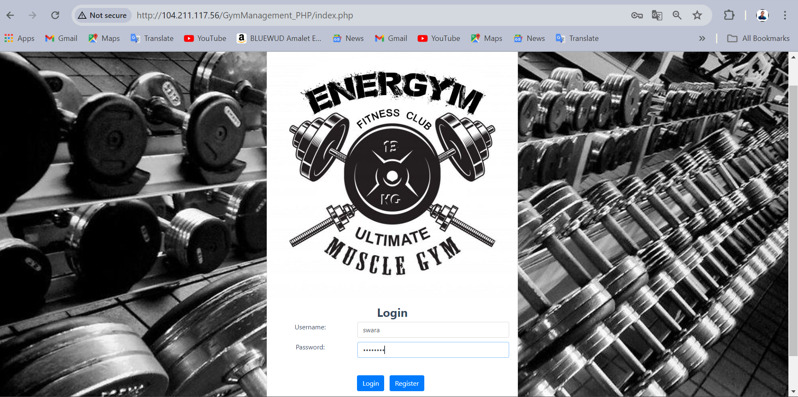
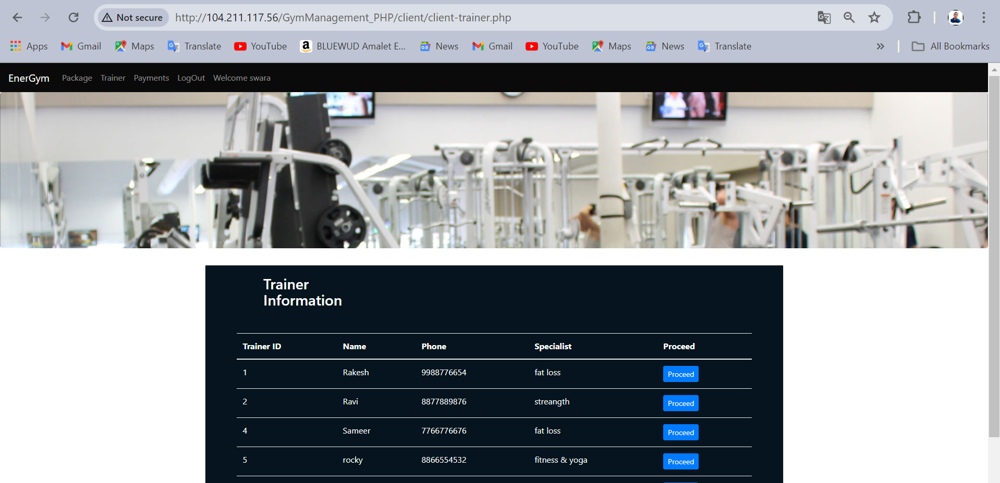

<h1>EnerGym</h1>

<h3>Working Links For The Project</h3>
<h4>Project Demo Url: www.energym.fun</h4>
<u>Admin details: <b>username:</b>admin  <b>password:</b>admin 
<h4>Github Repository:  https://github.com/Prachirsh/EnerGym </h4>
<h4>Project Documentation with Project video: https://drive.google.com/drive/folders/1v-MK9YHRRa2KvydUmNHRS_-N68TX_Q0b?usp=sharing</h4>

<h2>Project Aim</h2>
<h4>ENERGYM is a platform where any kind of user, with variety age group people can join the fitness club. This platform is built, so that the people can workout from their home without being judged. They can also join the gym (physically) as the lockdown reopens, no extra charges will be applicable.  
The main purpose is to create a fit and healthy environment for the members of the ENERGYM club where they can get touch with the people with same ideology with whom they can share their same passion about being fit and healthy at the same time.
The purpose of ENERGYM club reaches far beyond the need for physical fitness. These classes teach a myriad of skills, including gross motor skills, self-esteem, balance, coordination and teamwork. People learn a lot through play, and a fun, this can help set them up for a lifetime love of physical activity. 
</h4>

<h2>Azure Services Used</h2>
<h4><ol start="1">
  <li>Azure Virtual Machine(Windows)...[To create and host the machine in VM]</li>
  <li>Azure Monitoring Service(Alert)...[To getting alerts about system on mail and sms]</li>
  <li>Azure Backup Service...[To create backup for our webapp]</li>
  <li>Azure Storage Service...[To store backup files]</li>
  <li>Azure DNS service...[To give hostname to website]</li>
  <li>Azure AI service(Chatbot)...[To solve user queries]</li></ol>
</h4>

<h2>Web Technologies used</h2>
<h4><ul><li>HTML</li>
<li>CSS</li>
<li>Bootstrap</li>
<li>PHP</li>
<li>MYSQL</li></ul></h4>

<h2>Virtual Machine(Windows</h2>

           
<h2>Backup service</h2>

            

<h2>Monitoring Service(Alert)</h2>

        

<h2>Storage account service</h2>

     

<h2>Azure DNS and Hostinger</h2>

   

<h2>Azure AI service(laguage service-chatbot)</h2>

           

<h2>Resource Visualizer</h2>

 

<h2>Website Preview</h2>

      

<i><b>This is the overall project overview of Gym Management system with some Azure and AI service. I made this project for this internship purpose only. Thanks for giving time to Go through my overall project and repository<b></i>